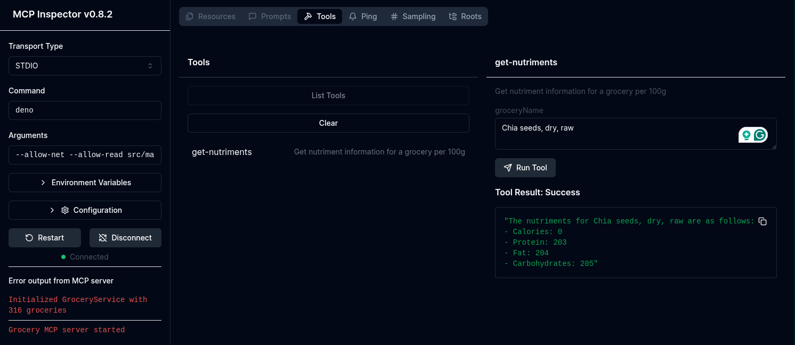

# Grocery MCP

This is a minimal MCP exploration project that allows passing gorcery nutriment information and others to LLMs via the MCP protocol.

## Usage

```bash
# Install dependencies
deno install

# Run standalone MCP
deno run src/main.ts 

# Run MCP inspector UI for testing
npx @modelcontextprotocol/inspector deno --allow-net --allow-read src/main.ts
```

## Screenshot

